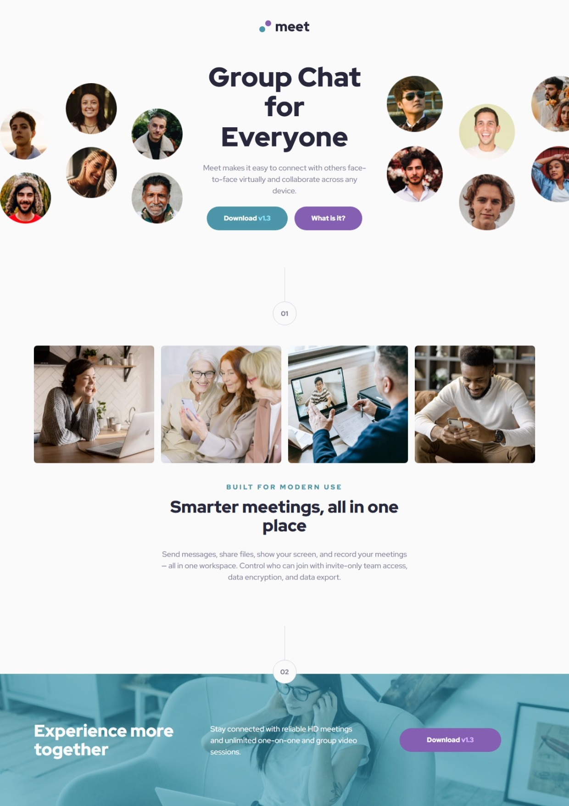

# Frontend Mentor - Meet landing page solution

This is a solution to the [Meet landing page challenge on Frontend Mentor](https://www.frontendmentor.io/challenges/meet-landing-page-rbTDS6OUR). Frontend Mentor challenges help you improve your coding skills by building realistic projects.

## Table of contents

- [Overview](#overview)
  - [The challenge](#the-challenge)
  - [Screenshot](#screenshot)
  - [Links](#links)
- [My process](#my-process)
  - [Built with](#built-with)
  - [What I learned](#what-i-learned)
  - [Useful resources](#useful-resources)
- [Author](#author)

## Overview

### The challenge

Users should be able to:

- View the optimal layout depending on their device's screen size
- See hover states for interactive elements

### Screenshot

### Links

- Solution URL: [https://meet-landing-page23.netlify.app/](https://meet-landing-page23.netlify.app/)
- Live Site URL: [https://meet-landing-page23.netlify.app/](https://meet-landing-page23.netlify.app/)

## My process

### Built with

- Semantic HTML5 markup
- CSS custom properties
- Flexbox
- CSS Grid
- Mobile-first workflow

### What I learned

I learnt about `::before` pseudo-class which allows one to add content before an html element. I mainly used it to add an image to my footer-section.

### Useful resources

- [Example resource 1](https://www.w3schools.com/css/css_pseudo_elements_content.asp) - This helped me understand `::before` pseudo-class.

## Author

- Frontend Mentor - [@ChasingCloudss](https://www.frontendmentor.io/profile/ChasingCloudss)
